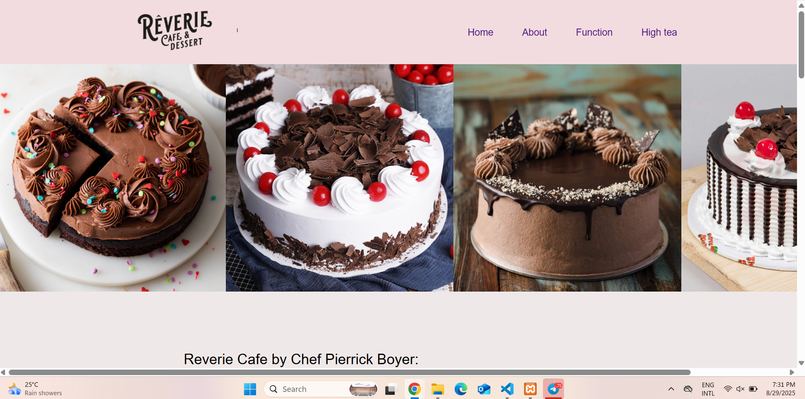
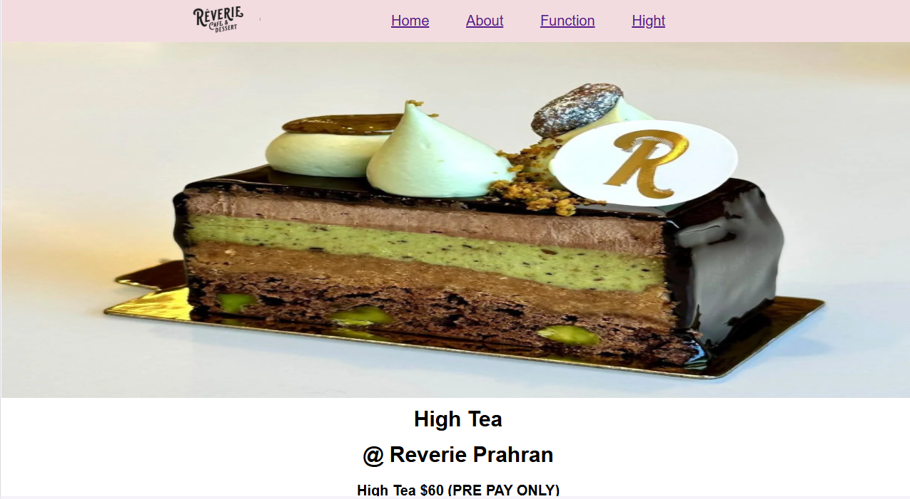
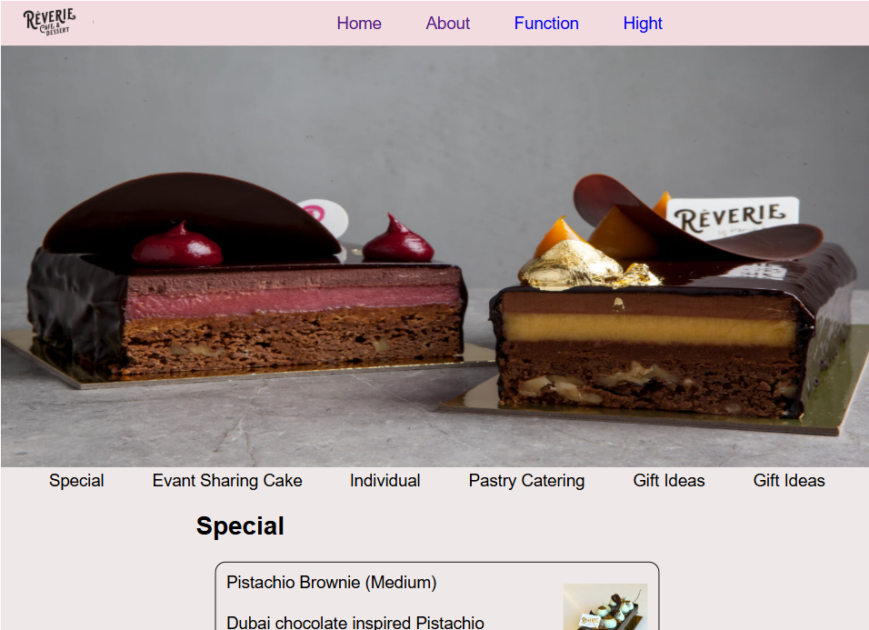
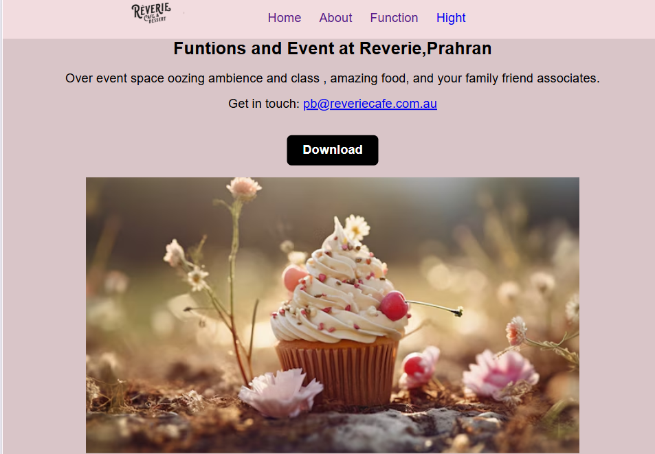

# 🎂 Cake Shop Website
### 📖 Description
The Cake Shop Website is an online platform where customers can browse, order, and customize cakes. The site showcases different cake categories, provides an easy-to-use order form, and displays store information.

- **Browse cake categories** (e.g., birthday cakes, wedding cakes, cupcakes, custom designs).
- **View product details**  such as ingredients, sizes, prices, and availability.

- **Customize cakes**  by choosing flavors, frosting, decorations, and special messages.
- **Place online orders** through an easy-to-use order form.
- **Access store information** including location, contact details, and business hours.

# ⚙️ Installation Guide
- **HTML**
- **CSS**
- **GIT**
# 👥 Team Members
Our team member name:

### Van Sievmey

### Chhea Chanthea

### Sen Sokseyla
# 🌍 Deployed Link

#  📸 Screenshots (Optional)
## Home page

## About page

## Function page

## Hight
